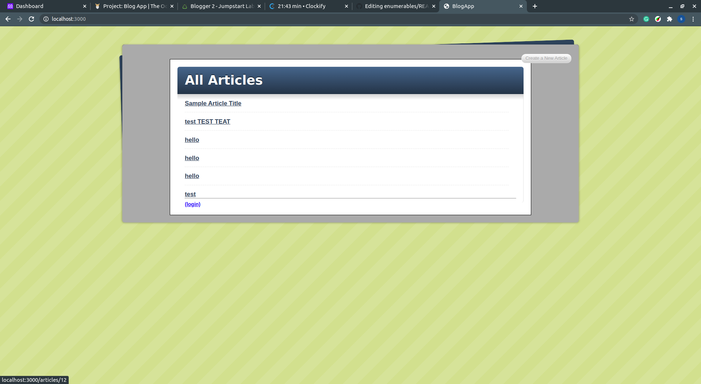

# Blogger

> This is our first project built with ROR to practice the workflow to build a backend application .

<br>



## Live Demo
[Live Demo Link](https://guarded-savannah-11313.herokuapp.com/)


## Built With

- Ruby on Rails 5.2.4.4


## Getting Started

To get a local copy up and running follow these simple example steps.

- Go to the main page of te repo.
- Press the "Code" button and get the repo link.
- Clone it using git.

### Prerequisites

- Ruby -v2.7.0p0

- Ruby on Rails 5.2.4.4


### Setup
 - Open a terminal
 - Copy this code : 
        ```
        git clone git@github.com:sanadwj/blog-app.git
        ```

### Usage

- Personal Project - Create a blog app to practice the basic steps to create a rails app. 
       

## Authors

👤 **Carlos Veiga**

- Github: [@wrakc](https://github.com/wrakc)
- Twitter: [@carlosveig](https://twitter.com/carlosveig)
- Linkedin: [chveiga](https://linkedin.com/chveiga)  

👤 **Sanad Walid Abujbara**

- Github: [@sanadwj](https://github.com/githubhandle)
- Twitter: [@sandooog](https://twitter.com/sandooog)
- Linkedin: [sanad-abujbara](https://linkedin.com/in/sanad-abujbara)

## 🤝 Contributing

Contributions, issues and feature requests are welcome!


## Show your support .

Give a ⭐️ if you like this project!

## Acknowledgments

- Microverse Team 124 (The Minskins)
- Microverse Team 139 (The Thanatos)

## 📝 License

This project is [MIT](lic.url) licensed.